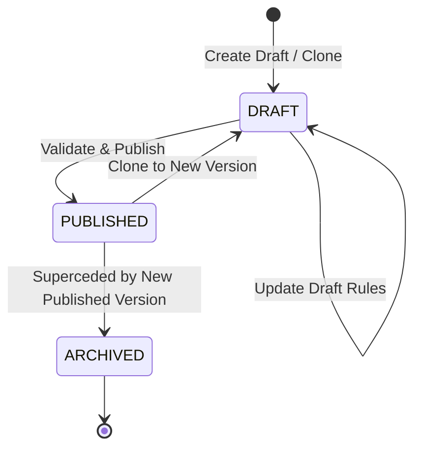

# Phase 4 — Brand Pack Engine & Workflow Configuration

## Overview

Phase 4 transitions the **Booran Warranty Evidence Capture System** from hardcoded/static evidence checks into a dynamic, configuration-driven **Brand Pack Engine**. The Brand Pack Engine forms the central architectural foundation for both the Technician Mobile Capture App and the Warranty Review Web Portal.

```text
Brand Pack
     ↓
Warranty Rules
     ↓
Fault Type
     ↓
Required Evidence
     ↓
Technician Capture Workflow
```

---

## Architecture & Domain Models

### 1. Brand (`Brand`)
Represents an automotive franchise represented across Booran dealerships.
- `code`: Unique OEM identifier (e.g. `BYD`, `HYUNDAI`, `MG`, `CHERY`).
- `name`: Brand legal/commercial name (e.g. `BYD Auto Australia`).
- `status`: `ACTIVE` | `INACTIVE`.
- `logoUrl`: Optional OEM emblem URL.
- `oemPortalUrl`: OEM warranty portal URL.
- `applicableSites`: Array of dealership site codes authorized to service this brand.

### 2. Dealership Site (`Site`)
Represents a physical Booran dealership rooftop and service facility.
- `code`: Unique site identifier (e.g. `CRANBOURNE`, `MELBOURNE`, `DANDENONG`).
- `name`: Commercial site description (e.g. `Booran BYD Cranbourne`).
- `address`: Structured physical address (`street`, `suburb`, `state`, `postcode`).
- `status`: `ACTIVE` | `INACTIVE`.
- `brands`: Authorized OEM franchises active at this facility.
- `phone`, `email`: Workshop service department contact details.

### 3. Brand Pack (`BrandPack`)
The core warranty evidence schema specification for an OEM brand and site context.
- `brandId`: Foreign reference to Brand MongoDB ObjectId.
- `brandCode`: Cached OEM code (e.g. `BYD`).
- `version`: Version string (e.g. `v1.0`, `v2.0`).
- `status`: `DRAFT` | `PUBLISHED` | `ARCHIVED`.
- `applicableSites`: Array of site codes where this pack applies. If empty, applies to **all sites** servicing the brand.
- `vehicleRules`:
  - `vinRequired`: boolean
  - `vinOcrEnabled`: boolean
  - `odometerRequired`: boolean
  - `frontPhotoRequired`: boolean
  - `supportedPowertrains`: Array of `EV` | `PHEV` | `HYBRID` | `ICE`
  - `decodeVin`: boolean
- `tier1Items`: Array of baseline evidence requirements mandatory for all claims (e.g. VIN plate photo, odometer reading photo, front 45-degree vehicle photo, repair order header).
- `faultTypes`: 7 primary defect categories containing `tier2Items` (Tier 2 fault-specific evidence rules).
- `conditionalRules`: Dynamic rules evaluated when specific repair conditions occur (e.g. part replaced, high-voltage battery work, noise complaint, diagnostic scan performed).
- `namingRules`: OEM file naming templates matching warranty portal ingestion standards.
- `qualityRules`: Photo resolution, sharpness score threshold, max video duration (seconds), max file size (MB).

---

## Versioning & Immutability Lifecycle

Brand Packs implement a strict audit lifecycle:



1. **DRAFT**:
   - Only state where rules, fault types, conditional items, and naming templates can be edited.
   - Mutated via `PUT /api/v1/brand-packs/:id`.
2. **PUBLISHED**:
   - Strictly **immutable**. Attempting to modify a published pack results in `403 Forbidden`.
   - When a draft pack is published for a brand & site scope, any existing active published pack matching that scope is automatically transitioned to `ARCHIVED`.
   - Actively served to mobile technicians and web warranty clerks.
3. **ARCHIVED**:
   - Read-only historical audit reference.
   - Existing warranty claims submitted under this version retain their reference to ensure historical legal and financial integrity.
4. **Cloning**:
   - Published packs can be cloned via `POST /api/v1/brand-packs/:id/clone` to create a new `DRAFT` version with an incremented version tag (e.g., `v1.0` -> `v2.0`).

---

## Seeded BYD Specification

The database seed (`backend/api/src/database/seed.ts`) deploys the official BYD Australia warranty evidence specification:

### Tier 1 Baseline Items (5 items)
1. `VIN_PLATE_PHOTO`: High-resolution photograph of compliance VIN plate / door pillar sticker.
2. `ODOMETER_PHOTO`: Clear photo of instrument cluster showing exact vehicle mileage and power-on state.
3. `VEHICLE_FRONT_PHOTO`: 45-degree angle front view showing vehicle registration plate, make, and general condition.
4. `RO_HEADER_DOCUMENT`: Scan or photo of signed Repair Order work authorization sheet.
5. `CUSTOMER_CONCERN_NOTES`: Photo of technician initial writeup of customer stated defect.

### BYD 7 Defect Categories (Tier 2 Items)
1. **HIGH_VOLTAGE_BATTERY** (High Voltage Traction Battery & BMS)
   - `BMS_FAULT_CODES`: Screenshot/export of BYD VDS scanner displaying BMS error codes.
   - `CELL_VOLTAGE_DELTA`: Live data log of max/min cell voltage differential under load.
   - `BATTERY_PACK_INSPECTION`: Photo of underside battery pack casing showing physical integrity / lack of impact.
   - `INSULATION_RESISTANCE`: Mega-ohm insulation test meter readout photo.
2. **DRIVE_UNIT_MOTOR** (Electric Drive Motor & Inverter)
   - `MOTOR_RESOLVER_OFFSET`: Diagnostic screen verifying motor resolver angle calibration.
   - `INVERTER_COOLANT_FLOW`: Photo/video verifying EV coolant circuit aeration and pump pressure.
   - `TRANSMISSION_FLUID_SAMPLE`: Photo of reduction gear oil droplet inspection sheet.
3. **CHARGING_SYSTEM** (OBC, DC Fast Charge Port, CCU)
   - `CHARGE_PORT_PINS`: Close-up macro photo of CCS2 / Type 2 charging pins checking for heat discoloration or pin spread.
   - `DC_FAST_CHARGE_LOG`: Graph trace showing handshake, CP/PP line voltage, and abort reason.
   - `OBC_COMM_STATUS`: VDS controller communication tree status screen.
4. **BRAKING_CHASSIS** (Regenerative & Friction Braking, EPS, Suspension)
   - `BRAKE_PAD_THICKNESS`: Vernier caliper measurement photograph on inner and outer pads.
   - `ROTORS_DISC_RUNOUT`: Dial test indicator reading runout measurement photo.
   - `STEERING_ANGLE_CALIBRATION`: Steering torque and angle sensor zero-point live data screen.
5. **THERMAL_MANAGEMENT** (Heat Pump, Octovalve, Battery Chiller, Cabin HVAC)
   - `HEAT_PUMP_PRESSURES`: Dual-manifold gauge photos displaying high and low side refrigerant pressures.
   - `EXPANSION_VALVE_OPERATION`: Electronic expansion valve position live parameter readout.
   - `OCTOVALVE_PORT_INSPECTION`: Inspection photo of coolant valve manifold connections.
6. **ADAS_BODY_ELECTRONICS** (Camera, Radar, DiLink Screen, BCM)
   - `CAMERA_CALIBRATION_TARGET`: Photo of vehicle positioned in front of OEM ADAS radar/camera calibration board.
   - `DILINK_SOFTWARE_VERSION`: Infotainment screen showing MCU, Android OS, and DSP software build numbers.
   - `RADAR_ALIGNMENT_BUBBLE`: Inclinometer bubble level photo on front millimeter-wave radar sensor.
7. **INTERIOR_BODY_TRIM** (Panoramic Glass, Seat Mechanisms, Weatherstrips)
   - `DEFECT_MACRO_PHOTO`: Close-up macro photo of physical imperfection with scaling rule applied.
   - `WATER_LEAK_TRACE`: Powder or moisture trace photograph demonstrating ingress path.
   - `MECHANISM_TRAVEL_VIDEO`: Video demonstrating latch, motor, or motorized vent failure in operation.

### Conditional Evidence Rules (4 rules)
1. `COND_PART_REPLACEMENT`: When `partBeingReplaced = true` -> Requires `OLD_PART_WITH_TAG` (Old part with handwritten RO tag) and `NEW_PART_UNBOXED` (New OEM part showing box barcode).
2. `COND_NOISE_VIBRATION`: When `isNoiseOrOperationalFault = true` -> Requires `AUDIO_VIDEO_SAMPLE` (10-30s video with clear audio demonstrating noise under operating conditions).
3. `COND_HV_DE_ENERGIZATION`: When `highVoltageInvolved = true` -> Requires `HV_SAFETY_CHECKLIST` (Completed 5-point HV safety signoff including zero-voltage verification).
4. `COND_DIAGNOSTIC_CODES`: When `hasDiagnostics = true` -> Requires `FULL_DTC_SESSION_LOG` (Complete pre-scan and post-scan electronic diagnostic summary).

### OEM File Naming Rules (11 rules)
Matches BYD Australia warranty audit submission standard:
- VIN Photo: `{RO}VIN.{ext}`
- Odometer: `{RO}ODO.{ext}`
- Front View: `{RO}FRONT.{ext}`
- RO Document: `{RO}RO_HEADER.{ext}`
- Battery Underbody: `{RO}BATT_CASING.{ext}`
- BMS Diagnostic: `{RO}BMS_DTC.{ext}`
- Drive Motor: `{RO}MOTOR_RESOLVER.{ext}`
- Charge Port: `{RO}CHARGE_PORT.{ext}`
- Heat Pump: `{RO}AC_PRESSURE.{ext}`
- ADAS Radar: `{RO}ADAS_CALIB.{ext}`
- Old Part Replaced: `{RO}PART_OLD.{ext}`

---

## API Endpoints

### Brands
- `GET /api/v1/brands` — List all brands
- `GET /api/v1/brands/:id` — Get brand by ID or code
- `POST /api/v1/brands` — Create brand (`brands.create` permission)
- `PUT /api/v1/brands/:id` — Update brand (`brands.update` permission)

### Sites
- `GET /api/v1/sites` — List all dealership rooftops
- `GET /api/v1/sites/:id` — Get site by ID or code
- `POST /api/v1/sites` — Create site (`sites.create` permission)
- `PUT /api/v1/sites/:id` — Update site (`sites.update` permission)

### Brand Packs
- `GET /api/v1/brand-packs` — List brand packs (supports `?brandId=`, `?brandCode=`, `?status=`, `?site=`)
- `GET /api/v1/brand-packs/:id` — Get pack by ID
- `GET /api/v1/brand-packs/resolve/active?brand=BYD&site=CRANBOURNE` — Resolve active published pack for mobile capture
- `POST /api/v1/brand-packs` — Create new draft pack (`brand_packs.create`)
- `PUT /api/v1/brand-packs/:id` — Update draft pack rules (`brand_packs.update`)
- `POST /api/v1/brand-packs/:id/clone` — Clone published pack to new draft (`brand_packs.create`)
- `POST /api/v1/brand-packs/:id/publish` — Validate and publish pack (`brand_packs.publish`)
- `POST /api/v1/brand-packs/:id/archive` — Archive pack (`brand_packs.archive`)
- `POST /api/v1/brand-packs/:id/validate` — Validate pack consistency (`brand_packs.view`)
- `GET /api/v1/brand-packs/versions/:brandId` — List all version revisions for brand

---

## Technician Mobile Capture Contract

When the Technician Mobile App initiates a repair order capture session:
1. Calls `GET /api/v1/brand-packs/resolve/active?brand={BRAND}&site={SITE}`.
2. The resolution service searches:
   - First: Pack matching `brandCode = BRAND`, `status = PUBLISHED`, and `applicableSites` contains `SITE`.
   - Fallback: Pack matching `brandCode = BRAND`, `status = PUBLISHED`, and `applicableSites = []` (all sites).
   - Default: Brand pack with `brandCode = 'COMMON'`.
3. The mobile app renders the capture flow:
   - Step 1: Vehicle Identification (VIN plate + Odometer reading)
   - Step 2: Baseline Tier 1 evidence (Front view, RO document)
   - Step 3: Defect category selection (Presents the 7 OEM fault types)
   - Step 4: Tier 2 fault-specific evidence collection
   - Step 5: Dynamic conditional items (e.g., prompt for old/new part photos if parts replaced)
   - Step 6: Evidence packaging and submission to portal
